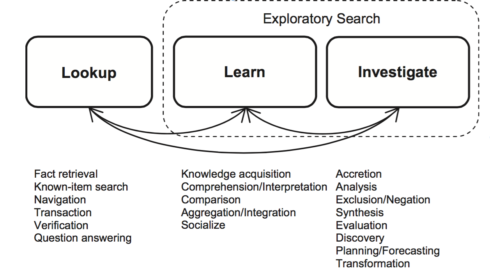
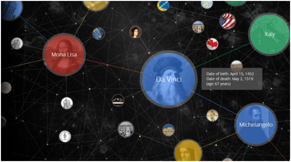
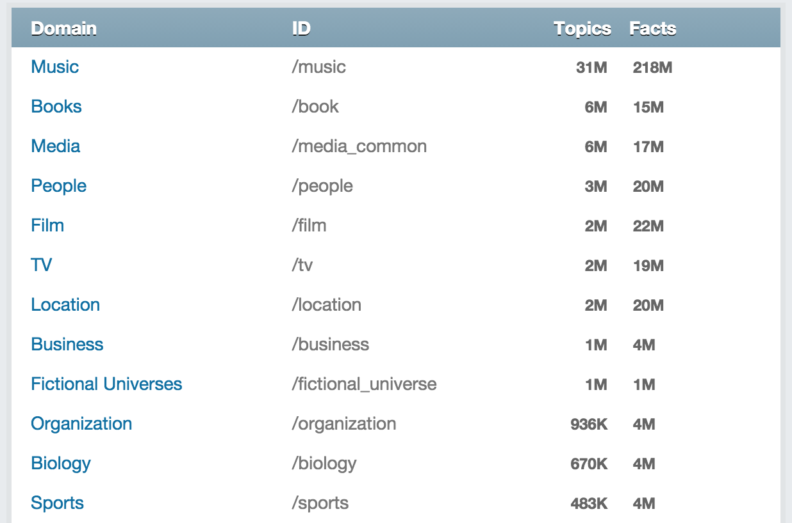

## Multi-Dimensional Exploratory Search on Unstructured Data

Praveen Kumar Srinivasan

[24-07-2015]

Notes:
- Hello Everyone My Name is ..
- I would like to talk about my PhD Thesis
- My Topic is ..
- It would be great to get your valuable feedback
- Please stop me anytime if you have a question or suggestion

---

### Age of Information

- Today Internet is the <span style="color:maroon">largest repository</span> of information.
- There are tens of <span style="color:maroon">billions</span> of static web pages and unbounded amount of dynamic web content.
- The advent of <span style="color:maroon">Social Networks</span> has increased the amount of data in an exponential manner.

Notes:
- Today Internet is the largest repository of Information
- There are about billion static webpages and unbounded number of dynamic data
- Now, with the advent of social media and mobile devices, the volume of data is increasing in an exponential manner
- Therefore the need for search engines is all the more important

Dynamic data is the data that typically on the server side. These cannot be crawled. They are typically manifested by the action of some script. ex - imdb, restaurant booking information

---

### Traditional Search Engines

- Retrieves specific sets of web pages <span style="color:maroon">based on keywords</span> found in user queries.
- Retrieves information only from the surface of the web.
- Social Networks have imposed the challenge of handling <span style="color:maroon">real-time data</span>.
- Processing the streams of real-time data can help enhance Search Engines, News media, and many other systems by feeding them with recent <span style="color:maroon">**knowledge**</span> about <span style="color:maroon">**current affairs**</span>.

Notes:
- Traditional Search Engines have primarily been based on bag of keywords words approach
- They typically crawl the web for static web pages and index the same
- The advent of **Social Networks** has increased the volume and velocity of the data.
- They have posed the search engines with the challenge of handling real-time data
- It will be beneficial to process the real-time data, since the data will provide knowledge about current affairs

When user inputs a query they match the relevant webpages based on the presence of keywords

-----

### Examples of Conventional Search

- The queries are keywords based.

Example:


-----


Notes:
- Skip this slide

---

<span style="color:maroon">Multi-Dimensional</span>

<span style="color:maroon">Exploratory Search</span>

on <span style="color:maroon">Unstructured Data</span>

---

### Key Terminologies

- **Domain** is a semantic field of interest.
- **Dimension** is an item of interest or an information attribute in a semantic field.

Notes:
- presentation
- Before I proceed to my research topic, I would like to take u through some important terminologies and their definitions

---

### Key Terminologies

- **Multi-Dimensional Queries** are those queries that span over a specific semantic field or over multiple semantic fields of interest, but contains multiple items of interest.
- **Multi-Domain Queries** are those queries that span more than one semantic fields of interest.
- **Complex Queries** are those queries which are Multi-Dimensional and/or Multi-Domain in nature.

Notes:
- Read the same

---

### Examples

1. ***What are mammals?***
    + The field of interest (Domain) is Zoology;
    + Item of interest (Dimension) is mammals.
2. ***Mammals that live in water***
    + The field of interest (Domain) is Zoology;
    + Items of interest (Dimensions) are Mammals, Natural Habitat (Water).
3. ***Movies related to mammals?***
    + The fields of interest (Domains) are Entertainment and Zoology;
    + Items of interest (Dimensions) are Movies in Entertainment, Mammals in Zoology.

Notes:
- Let us look at some examples
- Domain selection is very much user specific
- ex-2 is multi-dimensional query
- ex-3 is multi-domain query
- ex-3 is multi-dimensional query

---

### Multi-Domain vs Multi-Dimension Queries

- All Multi-Domain queries are Multi-Dimensional in nature
- Multi-Dimensional queries that span <span style="color:maroon">more than one domain</span> are Multi-Domain queries
- Multi-Dimensional queries that span <span style="color:maroon">single domain</span> are not Multi-Domain queries

-----

```
Let x, y, z be different 'Domains' and
    x = {x1,x2,x3,.........,xn},
    y = {y1,y2,y3,.........,yn},
    z = {z1,z2,z3,.........,zn},
where x1, x2, x3, . . . . . . . . . , xn are multiple Dimensions in Domain x.
Similarly, y1,y2,y3,.........,yn are multiple Dimensions in Domain y,
and z1,z2,z3,.........,zn are multiple Dimensions in Domain z.

Below are some examples to illustrate the relationship between
a Multi-Dimensional Queries and Multi-Domain Queries.

```

-----

```
• Query1: q1={x1,x2,x3}
The above query is Multi-Dimensional but not Multi-Domain Query as
    - there are 3 Dimensions (x1, x2, x3) in the query and
    - there is 1 Domain (x) in the query

• Query2: q2={x1,x2,x3,y1,y2}
The above query is Multi-Domain as well as Multi-Dimensional Query as
    - there are 3 Dimensions (x1, x2, x3) of Domain x - Multi-Dimension,
    - there are 2 Dimensions (y1,y2) of Domain y - Multi-Dimension and
    - there are 2 Domains (x, y) in the query - Multi-Domain

• Query3: q3={x1,y1,z1}
The above query is Multi-Domain as well as Multi-Dimensional Query as
    - there are 3 Domains (x, y, z) in the query - Multi-Domain, Multi-Dimension,
    - there is 1 Dimension in each of the Domain in the query.
    - Since, there are multiple items of interest in this query,
      thus, it is a Multi-Dimensional query.
```

---

### Exploratory Search

> EXPLORATORY SEARCH: FROM FINDING TO UNDERSTANDING - Gary Marchionini


Notes:
- Acts such as Fact retrieval, QA Answering are known as Lookup search
- Exploratory Search involve two kings of searching: learn and investigate
- Activities such as Knowledge acquisition, aggregation, interpretation, comparision are learning
- Activities such as analysis, evaluation, planning, discovery are know are investigate
- Current state-of-the-art machines do some of these activities on structured data or semi-structured data
- It would be great to have a search system do this on unstructured data

---

### Unstructured Data

- Refers to data that either does not have a pre-defined data model or is not organized in a pre-defined manner.
- It is typically text-heavy, but may contain data such as dates, numbers, and facts as well.
- This includes data such as Twitter Data, User Review.

Notes:
- Data that doesn't have either a pre-defined data model or is not organised in a pre-defined manner.
- Today most of the data that is being generated are unstructured data.
- Social Media, User Reviews, Blogs, are all unstructured data
- There are studies that indicate that about 70-80% of all the data that is generated in most organisations are unstructured data
- Some studies have forecasted that unstructured will have 50-fold growth in next 10 years.

---

### Problem Definition

**Multi-Dimensional Exploratory Search on Unstructured Data**

- In olden times, people used to take opinions of their friends, family for everything.
- Now, with the advancement of technology, people conduct searches using mobiles, and their queries have become Multi-Dimensional.

-----

### Problem Definition

- People seek varied kind of information such as <span >open-ended, open domain, analytical queries</span>.
- They aim to get the opinions of their virtual social circle or anyone on the web.

Notes:
- Their queries are focused towards getting the opinions of their virtual social circle or anyone on the web.
- They try to gather information from the extended social circle or anyone on the web.

-----

### Problem Definition

- Current state-of-the-art search systems do not capture:
    + the <span style="color:maroon">**subjective opinions**</span> and <span style="color:maroon">**recommendations of friends**</span>
    + the recent information that require <span style="color:maroon">**contextual**</span> or <span style="color:maroon">**domain-specific expertise**</span>.


Notes:
- Read the out the same

-----

### Why?

- Traditional Search Engines
    + Can handle Multi-Dimensional Queries of single domain
    + Cannot handle Multi-Dimensional Queries with Multiple Domains
- Current scenario
    + Independent search for each domain
    + Manual combination of the results

Notes:
- Traditional search engines can answer Multi-Dimensional Queries of single Domain, since, the keywords are likely to be present in the same web page
- However, they cannot answer Multi-Dimensional Queries which are Multi-Domain in nature, since the answer to the queries would typically be present in multiple web pages
- Normally, a person has to conduct individual searches on different domain-specific search engines and manually combine the findings, which is an exhaustive and time consuming work
- This kind of solution would greatly reduce the number of iterations required to get the desired answers and help the users

---

### Motivational Example

For Example: Consider a scenario where a person searches:

```
Where can I watch a movie and have good Chinese food?
```

And that person’s social circle has the below mentioned tweets related to movies and restaurants.

```
- you will not regret going to see X. It was AWESOME!
- just had dinner at Y. :D It was goooood. beeest chinese evarrr! ;) [location 1]
- best night evar \m. muv n rom dinner wiz hubby @ Z [location 2]
- omgg i ohhdee want noodle bar.. damn i wonder if its open lol =] [location 3]
```

Assuming `location 1 and 2` are close to the person’s current location, while `location 3` is in another country, the search system should return the following tweets:

-----

```
- you will not regret going to see X. It was AWESOME!
- just had dinner at Y. :D It was goooood. beeest chinese evarrr! ;) [location 1]
- best night evar \m. muv n rom dinner wiz hubby @ Z [location 2]
```

Now, the person can decide where he wishes to dine depending on his needs.
Similarly, the recommendations from a person’s social circle would be greatly beneficial in following scenarios as well.

```
- Closest petrol bunk near the hospital
- Cheap restaurant in Queens St and closest bus stop.
- Good places to visit in NY during summer
```

Notes:
- Read through and explain the example.
- What should the objective of the system be.
- Identify tweets that talk about the relevant items of interest from  a persons social circle.

---

### Twitter Data Characteristics

- **Length**: Maximum Length of a tweet is 140 characters.
- **Language**: They are hand typed, have misspellings, slang, emojis, abbreviations.
- **Open Domain**: The tweets can be on any topic.
- **Volume & Velocity**: The magnitude and speed of the data is vast.

Notes:
Twitter is a popular social media platform where users post short messages (called tweets) to their followers and read tweets of people whom they follow.
- Highlight why each of the above mentioned characteristics are challenges

---

### Related Work

- SECO
- Google's Knowledge Graph
- Freebase
- Watson

---

### Search Computing Group

- Multi-Domain and Multi-Dimensional Search
- Fixed Domains with Fixed Attributes
- Structured Data
- Datasets are predefined
- Uses **Local Ranking** and **Global Ranking** to rank the search results
- High search quality

Notes:
- Domains are predefined, and each domain has a set of attributes
- (Ex: Movie-Source A, Restaurants-Source B)
- Use of conventional RDBMS techniques for searching and joining the results
- High search quality as the data is structured

---

### Google's Knowledge Graph

- Semantic information gathered from a wide variety of sources.
- Contains over 570 million objects and more than 18 billion facts about and relationships
- Knowledge Graph ontologies and the techniques to search through these ontologies are <span style="color:maroon">proprietary</span>.
- Does not answer Multi-Domain Queries.
- Leverages the knowledge from the traditional search techniques to answer Multi-Domain Queries.

-----




Source: Google

---

### Freebase / WikiData

- Community-curated knowledge base
- It is an online collection of semantic data harvested from many sources
- Freebase has been acquired by Google
- All the data and the associated APIs would be migrated to WikiData, by Q3-2015
- Currently there are about 40 million nodes in the Freebase Graph
- Entity Tagging and TagIt interface
- MQL(Metaweb Query Language)

-----




Source: Freebase

-----

### Example of MQL

```
q={"type":"/people/person","id":"/en/madonna","children":\[\]}&as\_of\_time=2009-01
q={"type":"/music/album","name":null,"artist":{"id":"/en/bob_dylan"},"limit":3}&cursor
```

---

### Watson

- Jeopardy!
    + 25 Year old, US Television quiz show
    + Competition between 3 contestants
    + Open-Domain, Rapid QA, Stiff Penalties
- IBM's Watson
    + Grand Challenge to build a system to compete in Jeopardy! - 2007
    + Watson beats the humans in a nationally televised Jeopardy! match - 2011

Notes:
- Jeopardy! is a well-known television quiz show that has been on air in the United States for more than 25 years. It pits three human contestants against one another in a competition that requires rapidly understanding and answering rich natural-language questions, over a very broad domain of topics, with stiff penalties for wrong answers.
- In 2007, IBM Research took on the grand challenge of building a computer system that could compete with champions at the game of Jeopardy!. In 2011, the open-domain question-answering (QA) system, dubbed Watson, beat the two highest ranked players in a nationally televised two-game Jeopardy! match.

-----

### Watson

- Challenges
    + Completely self-contained, no internet connection, no external help in understanding or answering
    + In about 3 seconds, Watson has to- Parse & Understand the clue; Determine the best Answer; Compute the confidence of answers; Compete of buzzer; Answer the clue; Select the next clue or give up control

Notes:
- Like its human competitors, Watson has to be completely self-contained, no web search, no connection to the Internet, and no interaction with anyone else for help in understanding or answering the questions.
- In an average of just three seconds, Watson would have to parse a clue, understand what it was asking for, relate its meaning to what it had read, determine the best answer, and compute whether it was confident enough to buzz in. It would then have to buzz in fast enough to attempt an answer; speak the answer; and finally, based on the result, select the next clue or give up control to another player.

-----

### Watson

Examples:

```
- He was ruling the White House when men first stepped on the moon.
    + (Answer: Richard Nixon)
- The Jerry Maguire star who automatically maintains your vehicle’s speed.
    + (Answer: Tom Cruise control)
- Though only separated by one year in real life, she played mother to
  son Colin Farrell in Alexander.
    + (Answer: Angelina Jolie)
- The lead singer of the band Dengue Fever is from this country & often sings in Khmer
    + (Answer: Cambodia)
- COMMON BONDS: feet, eyebrows, and McDonald’s.
    + (Answer: arches)
- The name of this character, introduced in 1894, comes from the Hindi for bear.
    + (Answer: Baloo)
- On hearing of the discovery of George Mallory’s body, he told reporters he still
  thinks he was first.
    + (Answer: Sir Edmund Hillary)
```

Notes:
- The only 2 consecutive U.S. Presidents with the same first name.
    + (Answer: James Madison and James Monroe)
---

### Key Problems

- Knowledge Extraction
    + <span style="color:maroon">Named Entity Recognition and Classification</span>
    + Word Sense Disambiguation
    + Textual Entailment
    + Coherence Resolution
- Personalization, Socialization, Contextualization, Localisation
- Temporal Reasoning, Statistical Paraphrasing
- Semantic relation and type

Notes:
- Result Ranking
    + Local and Global Ranking

-----

### Definitions

- **Word sense disambiguation (WSD)** is the task of identifying the correct meaning of a word in context. Example:
    ```
    + I can hear bass sounds.
    + They like grilled bass.
    ```
- **Textual Entailment** is a directional relation between text fragments. Example:
    ```
    + Oswald murdered Kennedy
    + Kennedy was assassinated by Lee Oswald
    ```
- **Coherence Resolution** is the task of finding all expressions that refer to the same entity in a discourse. Example:
    ```
    + On hearing the discovery of George Mallory's body,
      he told reporters he still thinks he was first.
    ```

---

### Chosen Problem

Named Entity Recognition and Classification (NERC) on Twitter Data

---

### Traditional NERC Systems

- Use <span style="color:maroon">structure or grammar</span> to extract Named Entities
- Early systems relied on heuristics, while the modern system resort to machine learning
- Challenges: training datasets, previously unseen entities
- Supervised Learning rely on large training corpus
- Unsupervised learning techniques rely on lexical pattern, contextual statistics and features
- Rule based systems are preferred when there are not enough training samples

Notes:
- Address language independence and multi-lingual problems
- 1990-2006 for Traditional NERC Systems
- 2008-Now for Twitter based NERC systems

-----

### Different Approaches

- Training data
    + Tagged corpus
- Lexical Resources
    + WordNet, Wikipedia, Freebase
- Grammar or Rules
    + Contains (Mr.), ContainsAlpha(U.S)
- Lexical Patterns
    + Collocation, Prefix, Postfix
- White-List or Dictionaries
    + Celebrities, City, Movies

-----
### Traditional NERC Systems

Features used in NERC
- **Boolean Attribute** (isWordCapital)
- **Numeric Attribute** (lenOfWord)
- **Word Level Attributes** (case, punctuation, digits, characters, word endings, POS, morphology)
- **Document/Corpus Level Attributes** (word frequency, document frequency, co-occurrences, position in the text)
- **Lookup Attributes** (StopWords, dictionary lookup, abbreviations, prefix, postfix, location)

Notes:
- twitter related applications: what has been done?

Challenges?

-----

### Shortcoming of Traditional NERC Systems

- Dependency on Well-formed language structure
- Need for large training data
- Need for updated lexical resources
- Handling unseen patterns

---

### Twitter Data Features

- Social Circle
- Extended Social Circle
- Popularity of the tweet
- Popularity of the tweeter
- Trending HashTags
- Presence of HashTags
- Collocation with other HashTags
- Temporal Features
- Context: HashTags, search terms, user's social circle, extended social circle

Notes:
Context: Is the collection of tweets and the people who can influence the search result of a user.
It is the set of Targeted Streams that influences the search result.

---

### Characteristics of Social Media Data

- Slang
- Abbreviations
- Emojis
- HashTags
- Character Repetition
- Uppercase Characters

---

### NERC on Twitter Data

- Current state-of-the-art:
    + Usage of <span style="color:maroon">global trends</span> and <span style="color:maroon">local trends</span>
    + Handle cases where lexical resources fail
    + Shortcomings
        + Do not classify the entity type
        + Do not consider HashTags

---

### My Approach

- Unsupervised Learning/Semi-Supervised Learning
- Address shortcoming of traditional NERC systems
- Classify entities across open-domain
- Handle cases where:
    + lexical resources fail
    + not enough training data
    + rules would be hard to frame

Notes:
- Talk about the context
- give a running example
- write about the motivation behind the topic
- tell Why is this problem important - give example if possible
- Where can this be used and what all problem can be solved
    + watson medical domain
    + give other example

---

### Thats all! (For Now!)

Thanks and Feedbacks

