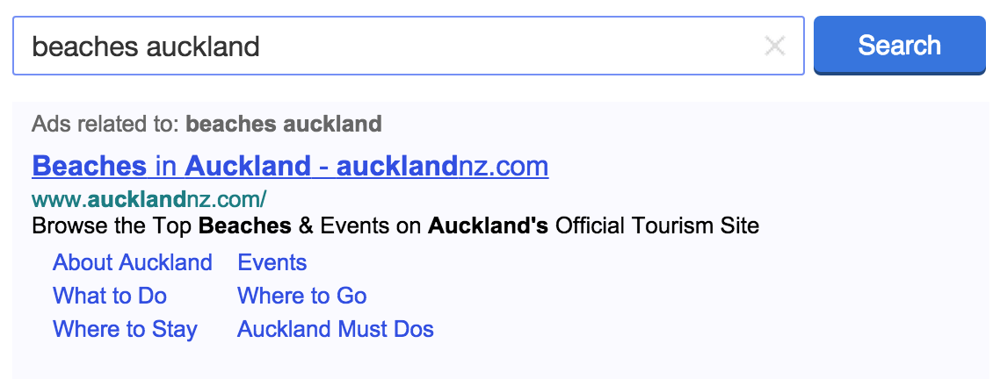
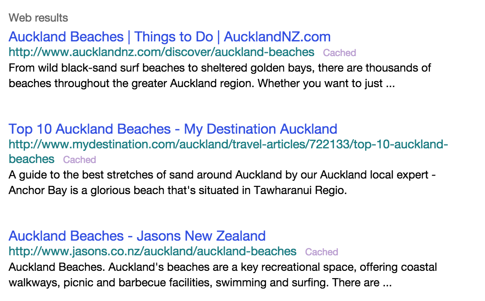
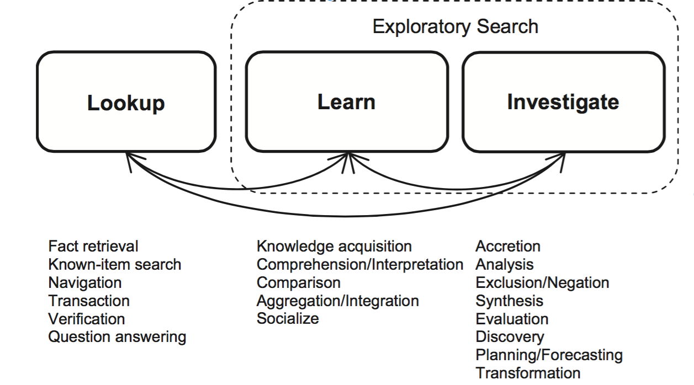

## Multi-Dimensional Exploratory Search on Unstructured Data

Praveen Kumar Srinivasan

[24-07-2015]

---

### Age of Information

- Today Internet is the largest repository of information.
- There are tens of billions of static web pages and unbounded amount of dynamic web content.
- The advent of Social Networks has upped the amount of data in an exponential manner.

---

### Traditional Search Engines

- Retrieves specific sets of web pages based on keywords found in user queries.
- Retrieves information only from the surface of the web.
- The advent of **Social Networks** has increased the volume and velocity of the data.
- Social Networks have imposed the challenge of handling real-time data.
- Processing the streams of real-time data can help enhance Search Engines, News media, and many other systems by feeding them with fresh knowledge about current affairs.

-----

### Different types of Queries

- **Informational Queries** are those where the main goal is to acquire information
- **Navigational Queries** are those where the goal is to find or reach a particular web site for browsing
- **Transactional Queries** are those where the goal is to perform some web-mediated activity such as perform interactive tasks such as downloading or buying a product.

---

### Examples of Conventional Search

- The queries are keywords based.

Example:


-----



---

### Key Terminologies

- **Domain** is a semantic field of interest.
- **Dimension** is an item of interest or an information attribute in a semantic field.

---

### Key Terminologies

- **Multi-Dimensional Queries** are those queries that span over a specific semantic field or over multiple semantic fields of interest, but contains multiple items of interest.
- **Multi-Domain Queries** are those queries that span more than one semantic fields of interest.
- **Complex Queries** are those queries which are Multi-Dimensional and/or Multi-Domain in nature.

---

### Examples

1. ***What are mammals?***
    + The field of interest (Domain) is Zoology;
    + Item of interest (Dimension) is mammals.
2. ***Mammals that live in water***
    + The field of interest (Domain) is Zoology;
    + Items of interest (Dimensions) are Mammals, Natural Habitat (Water).
3. ***Movies related to mammals?***
    + The fields of interest (Domains) are Entertainment and Zoology;
    + Items of interest (Dimensions) are Movies in Entertainment, Mammals in Zoology.

---

### Multi-Domain vs Multi-Dimension Queries

- All Multi-Domain queries are Multi-Dimensional in nature
- Multi-Dimension queries that span more than one domain are Multi-Domain queries
- But, Multi-Dimension queries that span one domain are not Multi-Domain queries

-----

```
Let x, y, z be different 'Domains' and
    x = {x1,x2,x3,.........,xn},
    y = {y1,y2,y3,.........,yn},
    z = {z1,z2,z3,.........,zn},
where x1, x2, x3, . . . . . . . . . , xn are multiple Dimensions in Domain x.
Similarly, y1,y2,y3,.........,yn are multiple Dimensions in Domain y,
and z1,z2,z3,.........,zn are multiple Dimensions in Domain z.

Below are some examples to illustrate the relationship between
a Multi-Dimensional Queries and Multi-Domain Queries.

```

-----

```
• Query1: q1={x1,x2,x3}
The above query is Multi-Dimensional but not Multi-Domain Query as
    - there are 3 Dimensions (x1, x2, x3) in the query and
    - there is 1 Domain (x) in the query

• Query2: q2={x1,x2,x3,y1,y2}
The above query is Multi-Domain as well as Multi-Dimensional Query as
    - there are 3 Dimensions (x1, x2, x3) of Domain x - Multi-Dimension,
    - there are 2 Dimensions (y1,y2) of Domain y - Multi-Dimension and
    - there are 2 Domains (x, y) in the query - Multi-Domain

• Query3: q3={x1,y1,z1}
The above query is Multi-Domain as well as Multi-Dimensional Query as
    - there are 3 Domains (x, y, z) in the query - Multi-Domain, Multi-Dimension,
    - there is 1 Dimension in each of the Domain in the query.
    - Since, there are multiple items of interest in this query,
      thus, it is a Multi-Dimensional query.
```

---

### Types of Data

- **Structured Data** is data that is inherent in a record or a file (fields).
- This includes data contained in relational databases and spreadsheets.

---

### Types of Data

- **Semi-Structured Data** is data that neither adheres to the formal structure of data model as in conventional database systems, nor it is raw.
- It contains tags or other markers to separate semantic elements and enforce hierarchies of records and fields within the data.
- Semi-Structured data includes XML, JSON.

---

### Types of Data

- **Unstructured Data** refers to information that either does not have a pre-defined data model or is not organized in a pre-defined manner.
- It is typically text-heavy, but may contain data such as dates, numbers, and facts as well.
- This includes data such as Twitter Data, User Review.

---

### Exploratory Search

> EXPLORATORY SEARCH: FROM FINDING TO UNDERSTANDING - Gary Marchionini



---

### Problem Definition

Multi-Dimensional Exploratory Search on Unstructured Data

- In olden times, people used to take opinions of their friends, family for everything.
- Now, with the advancement of technology, people conduct searches using mobiles, and their queries have become multidimensional.

-----

### Problem Definition

- People seek varied kind of information such as open-ended, open domain, analytical queries.
- Their queries are focused on their virtual social circle’s opinions.
- They try to gather information from the extended virtual social circle or anyone on the web.

-----

### Problem Definition

- Current state-of-the-art search systems do not capture the subjective opinions and recommendations of friends, or recent information that require contextual or domain-specific expertise.


-----

### Why?

- Traditional search engines can answer Multi-Dimensional Queries of single Domain as the keywords are likely to be present in the same web page, however, they cannot answer Multi-Dimensional Queries which are Multi-Domain in nature, since the answer to the queries would typically be present in multiple web pages.


-----

### Why?

- Normally, A person has to conduct individual searches on different domain-specific search engines and manually combine the findings, which is an exhaustive and time consuming work
- This kind of solution would greatly reduce the number of iterations required to get the desired answers and help the users

---

### Motivational Example

For Example: Consider a scenario where a person searches:

```
Where can I watch a movie and have good Chinese food?
```

And that person’s social circle has the below mentioned tweets related to movies and restaurants.

```
- you will not regret going to see X. It was AWESOME!
- just had dinner at Y. :D It was goooood. beeest chinese evarrr! ;) [location 1]
- best night evar \m. muv n rom dinner wiz hubby @ Z [location 2]
- omgg i ohhdee want noodle bar.. damn i wonder if its open lol =] [location 3]
```

Assuming `location 1 and 2` are close to the person’s current location, while `location 3` is in another country, the search system should return the following tweets:

-----

```
- you will not regret going to see X. It was AWESOME!
- just had dinner at Y. :D It was goooood. beeest chinese evarrr! ;) [location 1]
- best night evar \m. muv n rom dinner wiz hubby @ Z [location 2]
```

Now, the person can decide where he wishes to dine depending on his needs.
Similarly, the recommendations from a person’s social circle would be greatly beneficial in following scenarios as well.

```
- Closest petrol bunk near the hospital
- Cheap restaurant in Queens St and closest bus stop.
- Good places to visit in NY during summer
```

---

### Twitter Data Characteristics

Twitter is a popular social media platform where users post short messages (called tweets) to their followers and read tweets of people whom they follow.

Twitter messages have many unique attributes

- **Length**: Maximum Length of a tweet is 140 characters.
- **Language**: They are hand typed, have misspellings, slangs, emojis, abbreviations
- **Open Domain**: The tweets can be on any topic.
- **Volume & Velocity**: The magnitude and speed of the data is vast.

---

### What has been done?

- SECO
- Knowledge Graph
- Freebase
- Watson

---

### Different kinds of sub-problems?

- Knowledge Extraction
    + Named Entity Recognition and Feature Extraction on the unstructured data.
    + Domain Classification
    + Word Sense Disambiguation
    + Textual Entailment
    + Coherence Resolution
    + Personalization, Socialization, Contextualization, Localisation
    + Temporal Reasoning, Statistical Paraphrasing
    + Geo-spatial Inferencing, Semantic relation and type
- Graph Search Interface
- Multi-Dimensional Query Processing
- Result Ranking
    + Local and Global Ranking

---

### Chosen Sub-Problem

Named Entity Recognition and Classification(NERC) on Twitter Data

---

### Traditional NERC Systems

- Early systems relied on rules while the modern system resort to machine learning
- Most of these systems address language independence and multi-lingual problem
- Key challenges are the training datasets and previously unseen entities
- Rule based systems are preferred when there are not enough training samples
- The key shortcomings of Supervised and Semi-Supervised learning techniques are the need for large training corpus.
- Unsupervised learning techniques relies on lexical resources, lexical pattern, contextual statistics and features

-----

### Traditional NERC Systems

Features used in NERC
- **Boolean Attribute**(isWordCapital)
- **Numeric Attribute**(lenOfWord)
- **Word Level Attributes**(case, punctuation, digits, characters, word endings, POS, morphology)
- **Document/Corpus Level Attributes**(word frequency, document frequency, co-occurrences, position in the text)
- **Lookup Attributes**(StopWords, dictionary lookup, abbreviations, prefix, postfix, location)

---

### How am I going to solve?

- Unsupervised Learning
- Address shortcoming of traditional NERC systems
- Classify entities across open-domain

---

### Twitter Data Features

- User's Context
- Popularity of the tweet
- Popularity of the tweeter
- Trending HashTags
- Presence of HashTags
- Collocation with other HashTags
- Social Circle
- Extended Social Circle

---

### Characteristics of Social Media Data

- Slangs
- Abbreviations
- Emojis
- HashTags
- Character Repeating
- Uppercase Characters

---

### Future Directions

- Try out on different case-studies(Industrial Data, varied domains such as Medical Domain)

---

### Thats all!(For Now!)

Thanks and Feedbacks

